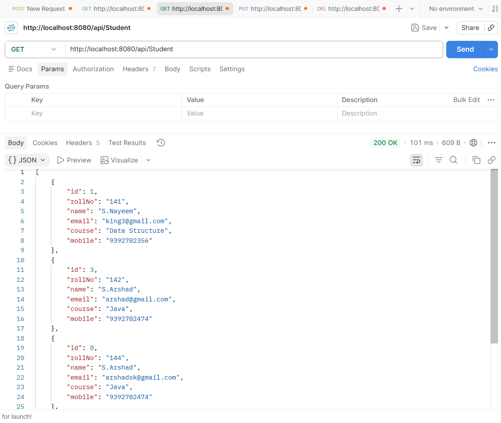
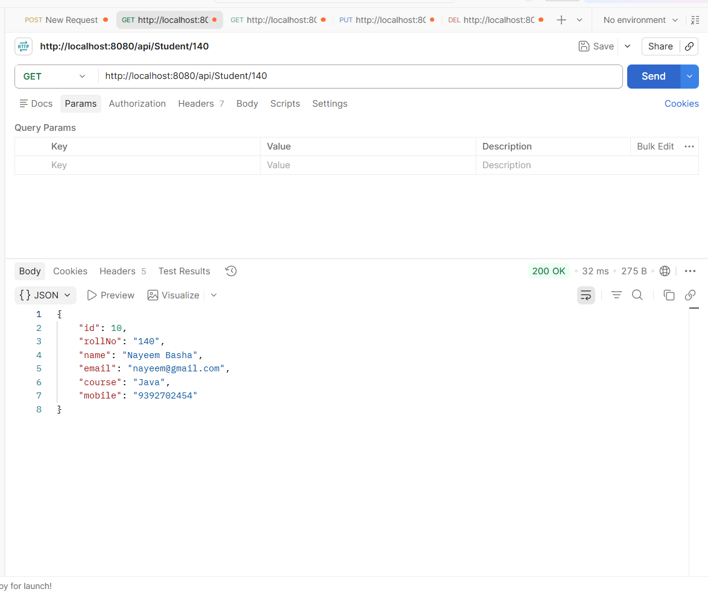

# Student Management REST API

A backend REST API for managing student records using **Spring Boot, Spring Data JPA, Hibernate, and MySQL**.

This project demonstrates a clean layered architecture with **DTO-based request/response handling, input validation, CRUD operations, and centralized exception handling**. 
Student records can be created, retrieved, updated, and deleted using RESTful API endpoints.


##  Project Purpose

The purpose of this project is to build a structured and maintainable **Student Management REST API** using Spring Boot.

The application provides APIs to:

* Create student records
* Retrieve all students
* Retrieve a student using Roll Number
* Update student information
* Delete student records
* Validate incoming request data
* Handle application-specific exceptions with meaningful HTTP responses

##  Features

* Complete **CRUD operations**
* RESTful API development using Spring Boot
* **Spring Data JPA** for database operations
* **Hibernate ORM** for persistence
* DTO-based request and response handling
* Input validation using **Jakarta Validation**
* Unique Roll Number and Email validation
* Custom exceptions
* Centralized exception handling using `@RestControllerAdvice`
* Standard HTTP status codes
* MySQL database integration
* Lombok for reducing boilerplate code

##  Tech Stack

| Technology         | Usage                           |
| ------------------ | ------------------------------- |
| Java               | Backend programming             |
| Spring Boot        | Application framework           |
| Spring Web         | REST API development            |
| Spring Data JPA    | Database access                 |
| Hibernate          | ORM / persistence               |
| MySQL              | Relational database             |
| Jakarta Validation | Request validation              |
| Lombok             | Boilerplate reduction           |
| Maven              | Build and dependency management |
| Postman            | API testing                     |
| IntelliJ IDEA      | Development environment         |


##  Project Architecture

The project follows a **layered architecture** to separate responsibilities and keep the application maintainable.


Client / Postman
       │
       ▼
┌─────────────────────┐
│     Controller      │
│   REST Endpoints    │
└─────────┬───────────┘
          │
          ▼
┌─────────────────────┐
│       Service       │
│  Business Logic     │
└─────────┬───────────┘
          │
          ▼
┌─────────────────────┐
│     Repository      │
│    Data Access      │
└─────────┬───────────┘
          │
          ▼
┌─────────────────────┐
│    MySQL Database   │
└─────────────────────┘


### Project Structure


src/main/java/com/Student/Project
│
├── controller
│   └── StudentController.java
│
├── service
│   ├── StudentService.java
│   └── StudentServiceImpl.java
│
├── repository
│   └── StudentRepository.java
│
├── entity
│   └── Student.java
│
├── Dto
│   ├── StudentRequestDto.java
│   └── StudentResponseDto.java
│
├── exception
│   ├── StudentNotFoundException.java
│   ├── DuplicateRollNoException.java
│   ├── DuplicateEmailException.java
│   ├── ErrorResponse.java
│   └── GlobalExceptionHandler.java
│
└── StudentManagementApplication.java

##  API Endpoints

**Base URL**

```text
http://localhost:8080/api/Student
```

| Method | Endpoint                | Description                | Success Status   |
| ------ | ----------------------- | -------------------------- | ---------------- |
| POST   | `/api/Student`          | Create a student           | `201 Created`    |
| GET    | `/api/Student`          | Get all students           | `200 OK`         |
| GET    | `/api/Student/{rollNo}` | Get student by Roll Number | `200 OK`         |
| PUT    | `/api/Student/{rollNo}` | Update student             | `200 OK`         |
| DELETE | `/api/Student/{rollNo}` | Delete student             | `204 No Content` |

### Sample Request

**POST `/api/Student`**

json
{
  "rollNo": "BCA101",
  "name": "Nayeem Basha",
  "email": "nayeem@example.com",
  "course": "BCA",
  "mobile": "9876543210"
}


##  Database

The application uses **MySQL** as the relational database and **Spring Data JPA/Hibernate** for persistence.

### Student Entity

| Field    | Description                 |
| -------- | --------------------------- |
| `id`     | Primary key, auto-generated |
| `rollNo` | Unique student Roll Number  |
| `name`   | Student name                |
| `email`  | Unique student email        |
| `course` | Student course              |
| `mobile` | Student mobile number       |

### Database Constraints

* `id` → Primary Key
* `rollNo` → Unique and Not Null
* `email` → Unique and Not Null
* `name` → Not Null
* `course` → Not Null
* `mobile` → Not Null


##  Postman API Testing

The REST APIs are tested using **Postman** to verify CRUD operations, validation, and exception handling.

### Create Student — POST


### Get All Students — GET



### Get Student by Roll Number — GET



### Update Student — PUT


### Delete Student — DELETE

![Delete Student]05-(screenshots/delete-student.png)

---

##  Exception Handling

The project implements centralized exception handling using **`@RestControllerAdvice`**.

The following cases are handled:

| Scenario                     | HTTP Status       |
| ---------------------------- | ----------------- |
| Student not found            | `404 Not Found`   |
| Duplicate Roll Number        | `409 Conflict`    |
| Duplicate Email              | `409 Conflict`    |
| Invalid request data         | `400 Bad Request` |
| Database integrity violation | `409 Conflict`    |

### Exception Handling Screenshots

#### Student Not Found


#### Validation Error


---

##  Input Validation

Request data is validated using **Jakarta Bean Validation**.

The API validates:

* Roll Number must not be blank
* Name must contain between 3 and 50 characters
* Email must follow a valid email format
* Course must not be blank
* Mobile number must contain a valid 10-digit Indian mobile number

Invalid requests return an appropriate `400 Bad Request` response.


##  How to Run

### 1. Clone the Repository

bash
git clone YOUR_GITHUB_REPOSITORY_URL


### 2. Open the Project

Open the project using **IntelliJ IDEA** or another Java IDE.

### 3. Configure MySQL

Create a MySQL database and configure the database connection in:


src/main/resources/application.properties


Example:

properties
spring.datasource.url=jdbc:mysql://localhost:3306/student_db
spring.datasource.username=root
spring.datasource.password=YOUR_PASSWORD

spring.jpa.hibernate.ddl-auto=update
spring.jpa.show-sql=true


> **Note:** Never commit your actual database password or other sensitive credentials to GitHub.

### 4. Run the Application

Run:


StudentManagementApplication.java


The application starts on:


http://localhost:8080


### 5. Test the APIs

Use **Postman** to test the available REST endpoints.

---

##  Key Concepts Demonstrated

This project demonstrates practical implementation of:

* Spring Boot REST APIs
* RESTful CRUD operations
* Controller-Service-Repository architecture
* Spring Data JPA
* Hibernate ORM
* DTO pattern
* Jakarta Bean Validation
* Custom Exception Handling
* `@RestControllerAdvice`
* HTTP status codes
* MySQL database integration
* Postman API testing
* Lombok


##  Author

**Nayeem Basha**

Java Backend Developer
**Java | Spring Boot | REST APIs | JPA | Hibernate | MySQL**

---
